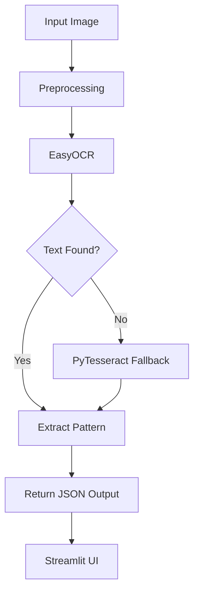

## 🌐 **Live Demo**
👉 **Streamlit App:** [StreamlitApp](https://ocrtextextraction.streamlit.app/)
👉 **GitHub Repo:** [Github Repo](https://github.com/Kalpesh-Rajput/OCR_Text_Extraction)

---

## ⭐ Overview

This project was built as part of the **AI/ML Assessment Task – OCR**, where the goal was:

✔️ Extract text from **shipping label images**  
✔️ Identify the target pattern (`_1_`, `_1`, `1_`, etc.)  
✔️ Handle **blur**, **rotation**, **noise**, **low quality**, and **mobile-captured images**  
✔️ Build a **working OCR backend + frontend**  

---

## 🚀 Evolution of the Model (Important Section)
This project went through **multiple versions** to reach stable accuracy:

### ❌ **1. EasyOCR only**  
- Failed to read many images  
- Shipping labels had blur & compression noise  
- `_1_` pattern often not detected  

### ❌ **2. PyTesseract only**  
- Strong preprocessing needed  
- Still weak on rotated / skewed images  

### ❌ **3. EasyOCR + Tesseract Hybrid**
- Much better than previous  
- But **blurred shipping labels** still caused wrong extraction  
- `_1_` pattern detection inconsistent  

### ⭐ **4. Final Hybrid Pipeline (Preprocessing + EasyOCR + Tesseract)**
✔️ Strong preprocessing  
✔️ Deskew + denoise + CLAHE contrast  
✔️ Dual-OCR engine fallback  
✔️ Custom pattern extraction logic  
✔️ Works on real-world, noisy shipping labels  

---

## 🧠 **Project Features**

### 🔧 1. Advanced Image Preprocessing
- Deskew (auto-rotation correction)  
- Border replication (prevents cutting pattern near edges!)  
- CLAHE contrast enhancement  
- Adaptive thresholding  
- Morphological operations  
- Resizing for OCR clarity  

### 🔠 2. Dual OCR Engine
- **EasyOCR (primary)**  
- **PyTesseract (fallback)**  

### 🎯 3. Target Pattern Extraction
Detects:  
- `_1_`  
- `_1`  
- `1_`  
- Any variant inside longer strings  

### 📦 4. Fully Modular Pipeline
- `preprocessor.py`  
- `ocr_engine.py`  
- `text_extraction.py`  
- `pipeline.py`  

### 🖥️ 5. Streamlit Frontend
- Upload image  
- View processed image  
- Get OCR output  
- Extract target ID  
- Show confidence score  

---

## 🏗️ Project Structure

```

OCR_Text_Extraction/
│
├── app.py
├── requirements.txt
├── README.md
├── results/
│   └── processed/...
├── src/
│   ├── preprocessing.py
│   ├── ocr_engine.py
│   ├── text_extraction.py
│   └── pipeline.py
├── tests/
│   ├── test_preprocess_ocr.py
│   ├── test_ocr_engine.py
│   └── test_pipeline.py
└── images/

````

---

## ⚙️ Installation

### 1️⃣ Create Virtual Environment
```bash
python -m venv ocrenv
````

### 2️⃣ Activate

Windows:

```bash
ocrenv\Scripts\activate
```

### 3️⃣ Install Requirements

```bash
pip install -r requirements.txt
```

### 4️⃣ Install Tesseract (Windows)

Download:
[https://github.com/UB-Mannheim/tesseract/wiki](https://github.com/UB-Mannheim/tesseract/wiki)

Verify:

```bash
tesseract --version
```

---

## 🧪 Testing the Pipeline

```bash
python tests/test_pipeline.py
```

---

## 🧩 Streamlit App

Run the UI:

```bash
streamlit run app.py
```

---

## 🧱 Architecture Diagram (Mermaid)



---

## 🧠 Preprocessing Steps (Detailed)

1. **Load Image**
2. **Add Padding** — prevents border text from being lost
3. **Deskew** using minAreaRect
4. **Convert to Grayscale**
5. **Apply CLAHE**
6. **Adaptive Thresholding**
7. **Morphology Close**
8. **Resize**

---

## 🔍 Pattern Extraction Logic

The system does not only look for `_1_`.
It detects:

```
_1_
_1
1_
…1…
…_1_…
```

Regex used:

```python
pattern = r"[_\-]?\d{1}[_\-]?"
```

---

## 🐞 Troubleshooting

### ❗ EasyOCR Error: "module PIL.Image has no ANTIALIAS"

Install correct Pillow version:

```bash
pip install pillow==9.5.0
```

### ❗ Tesseract Not Recognized

Add to PATH:

```
C:\Program Files\Tesseract-OCR\
```

### ❗ No pattern detected

* Try uploading original (non-cropped) image
* Check preprocessing output
* Increase pattern detection window

---

## 📌 Conclusion

This project demonstrates a **robust, production-ready OCR pipeline** capable of handling:

✔ low quality images
✔ mobile-captured labels
✔ rotation & skew
✔ pattern extraction
✔ hybrid OCR engines
